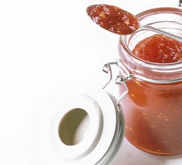

# Sweet Chilli Jam

{width="50%" align="right" loading="lazy"}

## Ingredients - Makes 4 Jars

|                               |
| ----------------------------- |
| **8** red peppers             |
| **10** red chillies           |
| **finger-sized piece** ginger |
| **8 cloves** garlic           |
| **400g** can cherry tomatoes  |
| **750g** golden caster sugar  |
| **250ml** red wine vinegar    |

## Method

1. Finely chop the peppers, chillies, ginger and garlic.
2. Blend the tomatoes
3. Add to a heavy-bottomed pan with the tomatoes, sugar and vinegar
4. Bring to the boil and remove any surface scum
5. Simmer for _50 mins_
6. Keep cooking while stirring frequently as it thickens
7. Allow to cool slightly
8. Transfer to sterilised jars, seal, and allow to cool completely.

!!! info "Storage" 
    Keeps for 3 months in a cool, dark cupboard - refrigerate once opened.

??? "Sources"
    Photo from BBC Good Food
    
    Recipe by Barney Desmazery, published in [BBC Good Food](https://www.bbcgoodfood.com/recipes/sweet-chilli-jam) in 2008
  