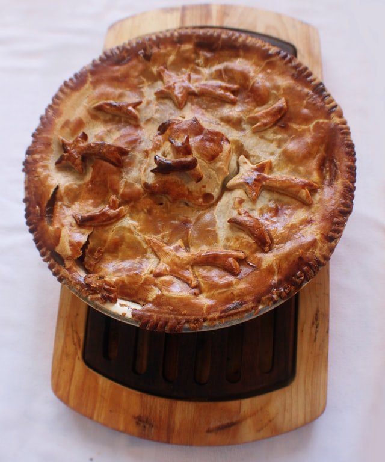

# Chicken and Mushroom Pie

{ width=400px align="right" loading="lazy"}

## Ingredients - Serves 2
* [ ] 400g Chicken
* [ ] 1/2 an onion
* [ ] 85g mushrooms
* [ ] 85g leeks
* [ ] 100ml milk
* [ ] 100ml stock
* [ ] 10g flour
* [ ] 30g butter
* [ ] 150g [Pastry](./pastry)
* [ ] 1 egg (beaten)

## Method
1. Set oven to 220°C
2. Coat chicken in flour, then brown in butter
3. Add vegetables, stock, milk. Cover and simmer until tender
4. Put into an ovenproof dish, cover with pastry, brush and seal with eggwash
5. Bake until pastry is golden brown _(20-30 mins)_