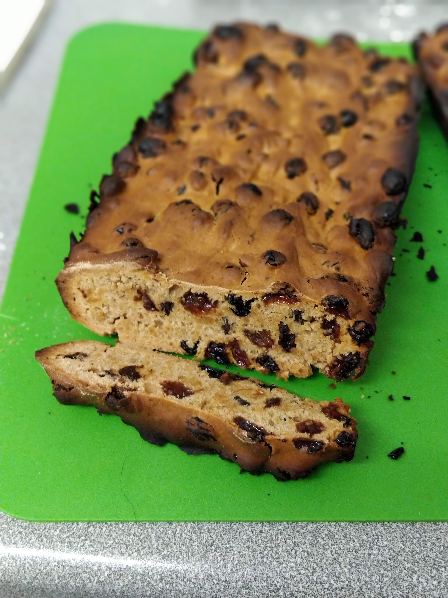

# Bara Brith

{width=50% align=right loading=lazy}

## Ingredients

|                              |
| ---------------------------- |
| **450 g** self-raising flour |
| **1 tsp** mixed spice        |
| **2 tbsp** warm marmalade    |
| **1** egg (beaten)           |
| **450 g** Dried mixed fruit  |
| **170 g** Soft Brown Sugar   |
| **225 ml** Hot Tea           |

## Method
1. Mix hot tea, brown sugar & dried fruit in a large bowl
    1. Leave overnight to soak
2. Add egg, marmalade, mixed spice and flour to the fruit and tea mixture
3. Preheat oven to 160°C
4. Pour into 2 greased loaf tins
5. Bake for 1 hour
    1. Loaf is finished when a knife comes clean from the centre

??? Source
    Recipe from a postcard on holiday in Newport, West Wales

    Photo by Me