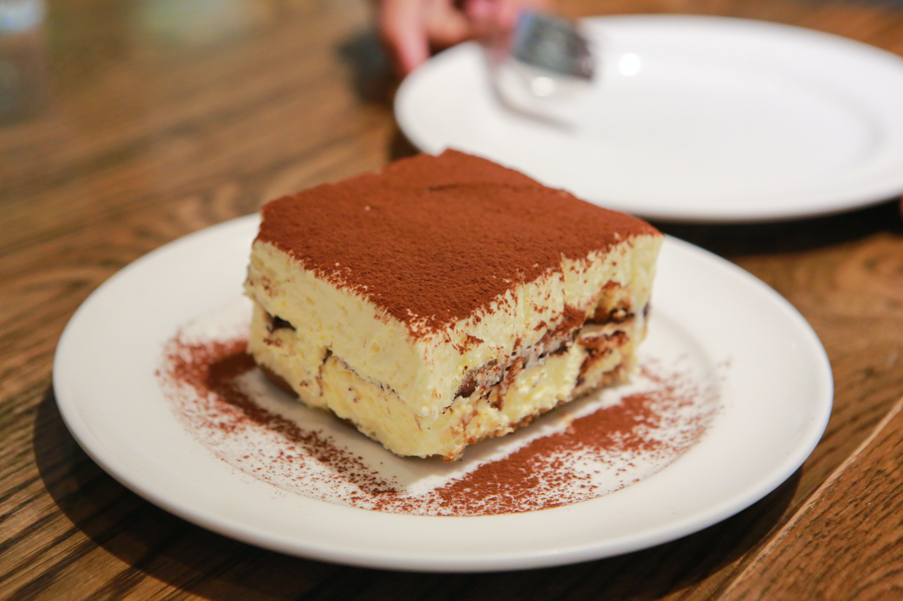

# Tiramisu

{loading=lazy}

# Ingredients

|                                     |
| ----------------------------------- |
| 500g mascarpone cheese              |
| 200g sponge fingers                 |
| 1 small cup espresso coffee         |
| 100ml alcohol (Rum, Brandy, Kahlua) |
| 2 egg yolks                         |
| 100g icing sugar                    |

# Method
1. Make coffee, add alcohol, leave to cool
2. Beat together cheese, egg yolks & icing sugar until fluffy
3. Dip sponge fingers in coffee-alcohol mix, layer into a dish
4. Cover with a layer of cheese mix
5. Repeat stage 3 & 4 until dish is full
6. Chill for 2 hours
7. Sprinkle with cocoa powder and serve

??? Sources
    Photo by [Peemapat Jomswang from Pexels](https://www.pexels.com/@peemapat-jomswang-10953849)

  