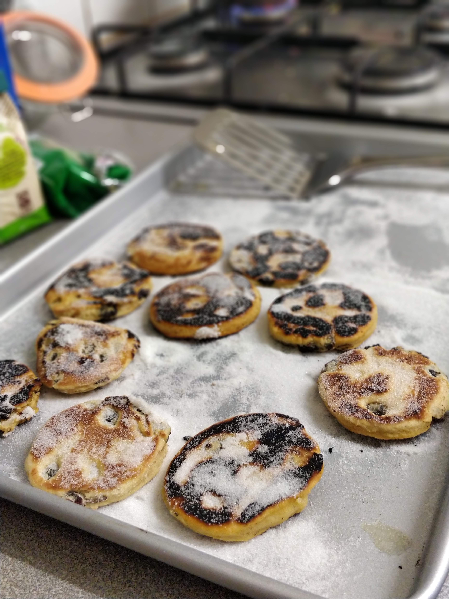

# Welsh Cakes / Pice ar y Maen

{width=50% align=right loading=lazy}

## Ingredients

|                              |
| ---------------------------- |
| **200 g** self-raising flour |
| **1/2 tsp** salt             |
| **100 g** margarine          |
| **50 g** sugar               |
| **50 g** currants            |
| **1** egg                    |
| **30 ml** milk               |

## Method
1. Mix flour and salt, rub in margarine, stir in sugar and currants
2. Mix to a fairly stiff dough with the egg and milk
3. Roll out to 5 mm thickness, and cut into rounds
4. Cook on a moderately hot greased griddle or pan
    1. About _3 minutes_ each side

??? Sources
    Home Recipes with Be-Ro (Centenary Edition)