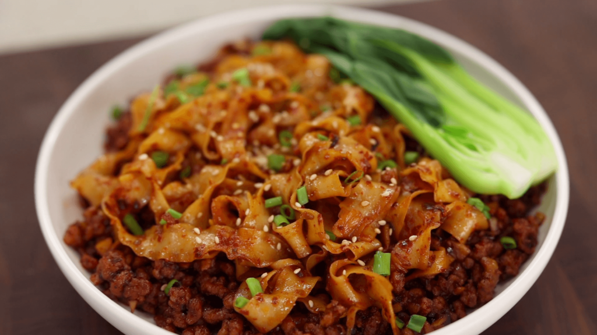

# Chili, Garlic & Pork Noodles

{loading="lazy"}

## Ingredients
| "Dry" Ingredients                             | "Wet" Ingredients          |
| --------------------------------------------- | -------------------------- |
| **15 cloves** garlic, finely chopped          | **2 tbsp** gochugaru       |
| **2 cm** ginger, grated                       | **1 tbsp** sugar           |
| **6** spring onions (split whites and greens) | **2 tbsp** soy sauce       |
| **500g** pork mince (20% fat content)         | **2 tbsp** oyster sauce    |
| **2** egg noodle nests                        | **1 tbsp** shaoxing wine   |

## Method
### Prep
1. Mix all "wet" ingredients together in a bowl.
2. Cook noodles according to packet instructions.

### Cooking 
1. Heat oil in a wok until it starts to smoke.
2. Cook garlic, ginger & spring onion **whites** until they start to char _(3-5 minutes)_.
3. Add pork mince and cook until no longer pink _(~5 minutes)_.
4. Reduce heat to medium-low and add the sauce mix.
5. Stir through, and cook for an additional _(2-3 minutes)_.
6. Add cooked noodles, fold together.
7. Serve topped with the spring onion **greens**, sesame seeds & chili crisp.

??? abstract "Sources"
    [Aaron & Claire's Chili Garlic Noodles](https://aaronandclaire.com/spicy-chili-garlic-noodles/)