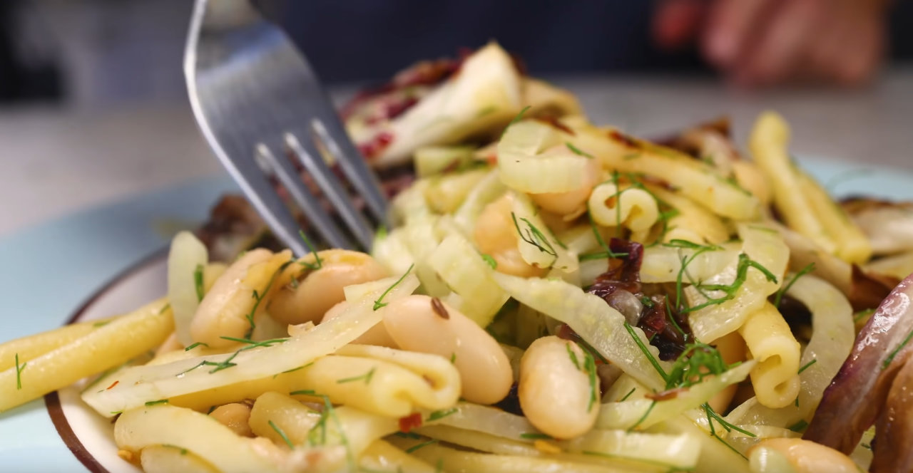

# White Bean and Fennel Pasta

{loading="lazy"}

## Ingredients - Serves 4

|                                     |
| ------------------------------------|
| **227g** pasta (penne)              |
| **1 bulb** fennel                   |
| **1 head** radicchio                |
| **1 tin (439g)** cannellini beans   |
| **some** caraway seeds              |
| **some** chili flakes               |
| **some** parmesan / pecorino cheese |
| **1** lemon                         |
| **some** salt                       |
| **some** pepper                     |
| **some** olive oil                  |

## Method
1. Halve the fennel, then thinly slice the halves
2. Wedge the radicchio
3. Drain and rinse the beans
4. Put the fennel slices, radicchio wedges and beans onto a sheet pan
5. Drizzle with olive oil, then sprinkle with salt, pepper, chili flakes and caraway seeds.
6. Brown under the grill for _a few minutes_
7. Toss together with cooked pasta
8. Garnish with olive oil, cheese **or** lemon, and fennel fronds

??? Sources
    Recipe from _Two sheet-pan pasta sauces | roasted grape tomatoes, white bean & fennel_ by _Adam Ragusea_
    
    [YouTube](https://www.youtube.com/watch?v=azNHrhGoOrc)
  